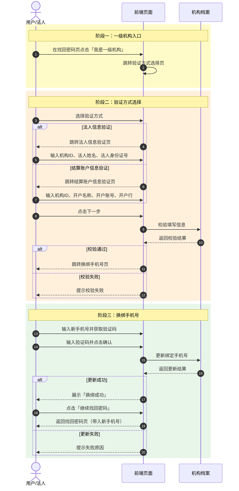
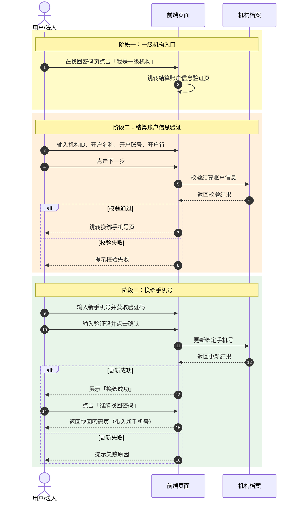

# 一级机构手机号找回方案 PRD

| 项目 | 内容 |
|---|---|
| 版本 | v1.0 |
| 更新日期 | 2026-08-06 |
| 状态 | 已完成 |
| 作者 | 产品经理 |

## 1. 背景
一级机构用户因旧手机号停用/丢失等原因无法接收短信验证码时，无法完成找回密码。本方案通过结算账户信息（或法人信息）完成身份核验，换绑新手机号后，引导用户回到找回密码流程继续使用新手机号完成操作。

## 2. 目标
- 解决一级机构无法使用旧手机号找回密码的问题。
- 在同一背景与卡片容器内完成「验证身份 → 换绑手机号 → 继续找回密码」闭环。
- 提供两种验证方式方案并明确推荐方案。

## 3. 推荐方案
**方案二：直结算账户信息验证**

理由：一级机构身份核验渠道固定，结算账户信息是机构档案中稳定采集的数据；跳过选择页可减少一步操作，流程更短，落地成本更低。

---

## 4. 数据可行性
机构档案已完整采集以下数据，可支撑本方案验证：
- 法人信息：法人姓名、法人身份证号。
- 结算账户信息：机构ID、开户名称、开户账号、开户行。

> 注：方案一中的两种验证方式属于不同身份维度，不能互为兜底；方案一仅作为「不同数据可得性」下的可选路径，非真正意义上的兜底机制。

---

## 5. 方案一：双验证方式选择

### 5.1. 入口
找回密码页提示文字下方增加「我是一级机构」文字按钮，字号 12px，右对齐。

### 5.2. 流程
```
找回密码页
  ↓ 点击「我是一级机构」
验证方式选择
  ├─ 法人信息验证
  └─ 结算账户信息验证
  ↓ 选择后点击下一步
信息填写页
  ↓ 校验通过
换绑手机号
  ↓ 确认
换绑成功
  ↓ 点击「继续找回密码」
返回找回密码页（已带入新手机号）
```

### 5.3. 时序图（目标系统交互）



### 5.4. 页面说明
| 页面 | 字段/内容 | 输入方式与限制 |
|---|---|---|
| 找回密码 | 绑定手机号、图片验证码、短信验证码、新密码 | — |
| 验证方式选择 | 法人信息验证 / 结算账户信息验证 二选一 | — |
| 法人信息验证 | 机构ID、法人姓名、法人身份证号 | 全部自由输入；身份证号 18 位 |
| 结算账户信息验证 | 机构ID、开户名称、开户账号、开户行 | 全部自由输入；字符限制见下方 |
| 换绑手机号 | 新手机号、短信验证码 | 手机号 11 位；验证码 4 位 |
| 换绑成功 | 成功提示 + 继续找回密码按钮 | — |

### 5.5. 字段输入规则
| 字段 | 输入方式 | 字符限制 | 校验规则 |
|---|---|---|---|
| 机构ID | 自由输入 | 1-20 位 | 必填 |
| 法人姓名 | 自由输入 | 1-20 位 | 必填 |
| 法人身份证号 | 自由输入 | 18 位 | 必填，身份证格式校验 |
| 开户名称 | 自由输入 | 1-50 位 | 必填 |
| 开户账号 | 自由输入 | 1-30 位 | 必填 |
| 开户行 | 自由输入 | 1-50 位 | 必填 |
| 新手机号 | 自由输入 | 11 位 | 必填，手机号格式校验 |
| 短信验证码 | 自由输入 | 4 位 | 必填 |

---

## 6. 方案二：直结算账户信息验证（推荐）

### 6.1. 入口
同方案一。

### 6.2. 流程
```
找回密码页
  ↓ 点击「我是一级机构」
结算账户信息验证
  ↓ 校验通过
换绑手机号
  ↓ 确认
换绑成功
  ↓ 点击「继续找回密码」
返回找回密码页（已带入新手机号）
```

### 6.3. 时序图（目标系统交互）



### 6.4. 与方案一差异
- 去掉验证方式选择页。
- 去掉法人信息验证路径。
- 点击入口直接跳转结算账户信息填写页。
- 换绑成功后同样返回找回密码页，形成闭环。

### 6.5. 页面说明
| 页面 | 字段/内容 | 输入方式与限制 |
|---|---|---|
| 找回密码 | 绑定手机号、图片验证码、短信验证码、新密码 | — |
| 结算账户信息验证 | 机构ID、开户名称、开户账号、开户行 | 全部自由输入；字符限制同方案一 |
| 换绑手机号 | 新手机号、短信验证码 | 手机号 11 位；验证码 4 位 |
| 换绑成功 | 成功提示 + 继续找回密码按钮 | — |

---

## 7. 接口定义

### 7.1. 校验结算账户信息
```
POST /api/org/verify-bank-account
```

**请求参数**
| 字段 | 类型 | 必填 | 说明 |
|---|---|---|---|
| orgId | string | 是 | 机构ID |
| accountName | string | 是 | 开户名称 |
| accountNo | string | 是 | 开户账号 |
| bankName | string | 是 | 开户行 |

**返回示例**
```json
{
  "code": 0,
  "data": { "verified": true }
}
```

### 7.2. 校验法人信息
```
POST /api/org/verify-legal-info
```

**请求参数**
| 字段 | 类型 | 必填 | 说明 |
|---|---|---|---|
| orgId | string | 是 | 机构ID |
| legalName | string | 是 | 法人姓名 |
| legalIdCard | string | 是 | 法人身份证号 |

**返回示例**
```json
{
  "code": 0,
  "data": { "verified": true }
}
```

### 7.3. 更新绑定手机号
```
POST /api/org/change-bind-phone
```

**请求参数**
| 字段 | 类型 | 必填 | 说明 |
|---|---|---|---|
| orgId | string | 是 | 机构ID |
| newPhone | string | 是 | 新手机号 |
| smsCode | string | 是 | 短信验证码 |

**返回示例**
```json
{
  "code": 0,
  "data": { "changed": true }
}
```

---

## 8. 异常处理

| 场景 | 前端提示 | 处理 |
|---|---|---|
| 机构ID不存在 | 机构ID有误，请核对后重试 | 停留当前页 |
| 结算账户信息不匹配 | 结算账户信息校验失败，请核对 | 停留当前页 |
| 法人信息不匹配 | 法人信息校验失败，请核对 | 停留当前页 |
| 新手机号已绑定其他机构 | 该手机号已被使用，请更换 | 停留换绑页 |
| 短信验证码错误 | 验证码错误或已过期 | 停留换绑页 |
| 短信验证码发送过频 | 操作过于频繁，请稍后再试 | 禁止重试并倒计时 |
| 接口超时/系统异常 | 网络异常，请稍后重试 | 支持重试 |

---

## 9. 安全策略
- 敏感字段（身份证号、银行账号）传输采用 HTTPS + 加密。
- 图片验证码用于防刷，短信验证码 60 秒倒计时 + 5 分钟内有效。
- 同一手机号单日短信发送次数上限 10 次。
- 同一机构ID单日验证次数上限 10 次，超出则锁定 24 小时。
- 接口做频次限制，防止暴力遍历机构ID。
- 操作完成后记录审计日志（操作人、机构ID、新旧手机号、操作结果、时间）。

---

## 10. 技术实现
- 单页内多 `section` 切换，通过 `.hidden` 控制显隐。
- 当前原型文件：
  - 方案一：`/index.html` + `/js/app.js`
  - 方案二：`/v2.html` + `/js/app-v2.js`
- 共用 `/css/style.css`。
- 时序图描述目标系统交互，当前原型以前端校验和页面切换为主。
- 换绑成功页「继续找回密码」按钮跳转回找回密码页，并自动带入新手机号，完成闭环。

## 11. 原型访问
已部署至 GitHub Pages，永久公开访问：

评审标注版（含产品评审意见与修改建议标注）：

| 方案 | 访问链接 |
|---|---|
| 方案一（双验证方式选择） | https://gaohailinga.github.io/org-phone-recovery-prototype/ |
| 方案二（直达结算账户信息验证，推荐） | https://gaohailinga.github.io/org-phone-recovery-prototype/v2.html |

纯净版（无评审标注，可直接演示）：

| 方案 | 访问链接 |
|---|---|
| 方案一（双验证方式选择） | https://gaohailinga.github.io/org-phone-recovery-prototype/index-original.html |
| 方案二（直达结算账户信息验证，推荐） | https://gaohailinga.github.io/org-phone-recovery-prototype/v2-original.html |

仓库地址：https://github.com/Gaohailinga/org-phone-recovery-prototype

## 12. 版本记录

| 版本 | 日期 | 修改人 | 修改内容 |
|---|---|---|---|
| v1.0 | 2026-08-06 | 产品经理 | 初始版本：完成需求背景、目标、双方案设计、接口定义、原型部署与访问链接 |
| v1.1 | 2026-08-07 | 产品经理 | 拆分评审标注版与纯净版原型并补充访问链接；新增 pm-workflow 技能与部署指南 |
