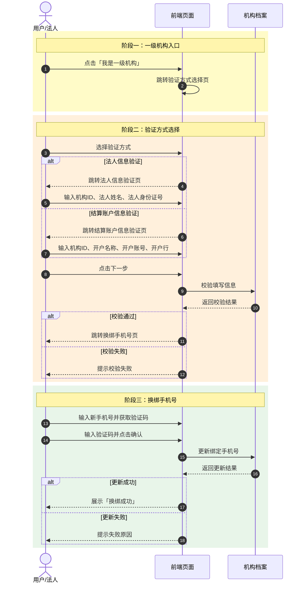
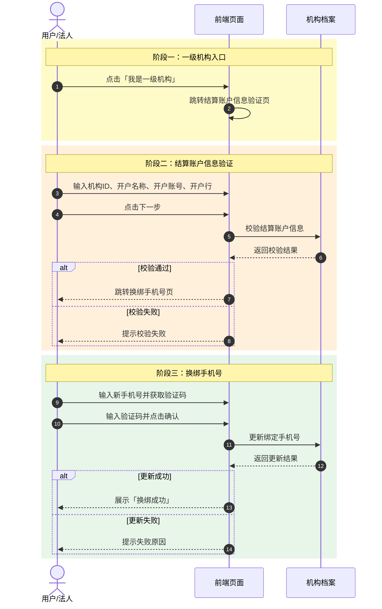

# 找回密码 — 一级机构手机号找回方案 PRD

## 背景
原找回密码页仅支持绑定手机号找回。现需为一级机构增加无法使用旧手机时的换绑手机号流程。

## 目标
- 不破坏原有找回密码功能。
- 在同一背景与卡片容器内完成流程切换。
- 提供两种产品方案供决策。

---

## 方案一：双验证方式选择

### 入口
找回密码页提示文字下方增加「我是一级机构」文字按钮，字号 12px，右对齐。

### 流程
```
找回密码
  ↓ 点击「我是一级机构」
验证方式选择
  ├─ 法人信息验证
  └─ 结算账户信息验证
  ↓ 选择后点击下一步
信息填写页
  ↓ 校验通过
换绑手机号
  ↓ 确认
换绑成功
```

### 时序图



### 页面说明
| 页面 | 字段/内容 |
|---|---|
| 找回密码 | 绑定手机号、图片验证码、短信验证码、新密码 |
| 验证方式选择 | 法人信息验证 / 结算账户信息验证 二选一 |
| 法人信息验证 | 机构ID、法人姓名、法人身份证号 |
| 结算账户信息验证 | 机构ID、开户名称、开户账号、开户行 |
| 换绑手机号 | 新手机号、短信验证码 |
| 换绑成功 | 成功提示 + 完成按钮 |

### 公共交互
- 表单校验、手机号/身份证正则校验。
- 短信验证码 60 秒倒计时。
- 图片验证码点击刷新。
- Toast 错误提示。

---

## 方案二：直结算账户信息验证

### 入口
同方案一。

### 流程
```
找回密码
  ↓ 点击「我是一级机构」
结算账户信息验证
  ↓ 校验通过
换绑手机号
  ↓ 确认
换绑成功
```

### 时序图



### 与方案一差异
- 去掉验证方式选择页。
- 去掉法人信息验证。
- 点击入口直接跳转结算账户信息填写页。

---

## 技术实现
- 单页内多 `section` 切换，通过 `.hidden` 控制显隐。
- 两个方案分别对应：
  - 方案一：`/index.html` + `/js/app.js`
  - 方案二：`/v2.html` + `/js/app-v2.js`
- 共用 `/css/style.css`。

## 建议
若一级机构用户身份核验渠道单一，优先方案二，流程更短；若需多一种核验兜底，保留方案一。
