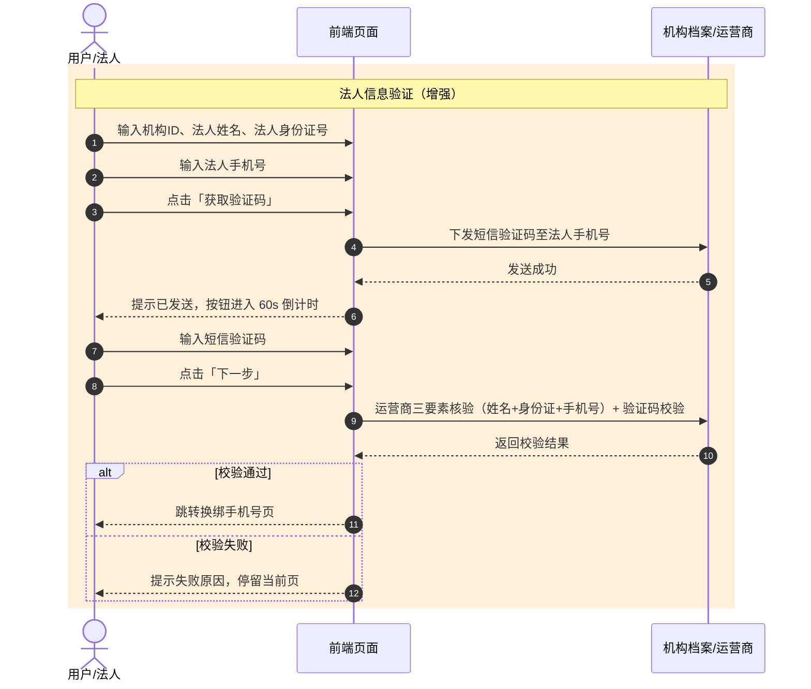

# 法人信息验证增强方案（运营商三要素核验 + 短信验证码）

| 项目 | 内容 |
|---|---|
| 版本 | v1.2 |
| 更新日期 | 2026-08-14 |
| 状态 | 已完成（原型已更新） |
| 作者 | 产品经理 |
| 所属需求 | 一级机构手机号找回方案（PRD v1.2） |

---

## 1. 背景

原「法人信息验证」仅校验机构ID、法人姓名、法人身份证号三项基础信息，验证强度不足：
- 无法确认手机号与法人身份的真实归属关系；
- 身份信息泄露后被冒用风险较高。

## 2. 方案目标

在法人信息验证环节增强身份核验强度：
1. 新增「法人手机号」输入，对接**运营商三要素核验**（法人姓名 + 身份证号 + 手机号）；
2. 新增「手机短信验证码」输入，验证码发送至法人手机号，确认手机号实时可用；
3. 验证码获取与换绑手机号环节完全一致（倒计时 + 校验弹窗）。

## 3. 流程变更

```
法人信息验证页（增强后）
  ├─ 机构ID        （必填）
  ├─ 法人姓名      （必填）
  ├─ 法人身份证号  （必填，18 位格式校验）
  ├─ 法人手机号    （必填，11 位格式校验，运营商三要素核验）
  └─ 短信验证码    （必填，4 位；点击「获取验证码」发送至法人手机号，60s 倒计时）
        ↓ 点击「下一步」逐项校验
    校验全部通过 → 跳转换绑手机号页
```

## 4. 时序图



## 5. 字段输入规则

| 字段 | 输入方式 | 字符限制 | 校验规则 |
|---|---|---|---|
| 机构ID | 自由输入 | 1-20 位 | 必填 |
| 法人姓名 | 自由输入 | 1-20 位 | 必填 |
| 法人身份证号 | 自由输入 | 18 位 | 必填，身份证格式校验 |
| 法人手机号 | 自由输入 | 11 位 | 必填，手机号格式校验；须与运营商登记一致（三要素核验） |
| 短信验证码 | 自由输入 | 4 位 | 必填，发送至法人手机号；点击「获取验证码」后 60s 倒计时 |

## 6. 交互细节

| 操作 | 交互 |
|---|---|
| 手机号为空/非法时点「获取验证码」 | 弹窗「请先输入正确的法人手机号」 |
| 手机号合法时点「获取验证码」 | 弹窗「验证码已发送至法人手机号」，按钮进入 60s 倒计时（与换绑手机号一致） |
| 验证码为空点「下一步」 | 弹窗「请输入正确的短信验证码」 |
| 全部字段合法点「下一步」 | 跳转换绑手机号页 |

## 7. 接口定义

```
POST /api/org/verify-legal-info
```

**请求参数**
| 字段 | 类型 | 必填 | 说明 |
|---|---|---|---|
| orgId | string | 是 | 机构ID |
| legalName | string | 是 | 法人姓名 |
| legalIdCard | string | 是 | 法人身份证号 |
| legalPhone | string | 是 | 法人手机号（运营商三要素核验） |
| smsCode | string | 是 | 法人手机短信验证码 |

**返回示例**
```json
{
  "code": 0,
  "data": { "verified": true }
}
```

## 8. 异常处理

| 场景 | 前端提示 | 处理 |
|---|---|---|
| 法人信息不匹配 | 法人信息校验失败，请核对 | 停留当前页 |
| 运营商三要素核验失败 | 法人手机号与运营商登记不一致，请核对 | 停留当前页 |
| 法人手机号短信验证码错误 | 验证码错误或已过期 | 停留法人验证页 |
| 短信验证码发送过频 | 操作过于频繁，请稍后再试 | 禁止重试并倒计时 |

## 9. 涉及原型文件

| 文件 | 说明 |
|---|---|
| `index.html` | 评审标注版方案一（新增法人手机号 + 短信验证码输入框与标注） |
| `js/app.js` | 评审标注版逻辑（获取验证码倒计时 + 三要素/验证码校验） |
| `index-original.html` | 纯净版方案一（同步新增输入框） |
| `js/app-original.js` | 纯净版逻辑（同步新增校验） |

> 方案二（直结算账户信息验证）无法人验证环节，不受影响。
