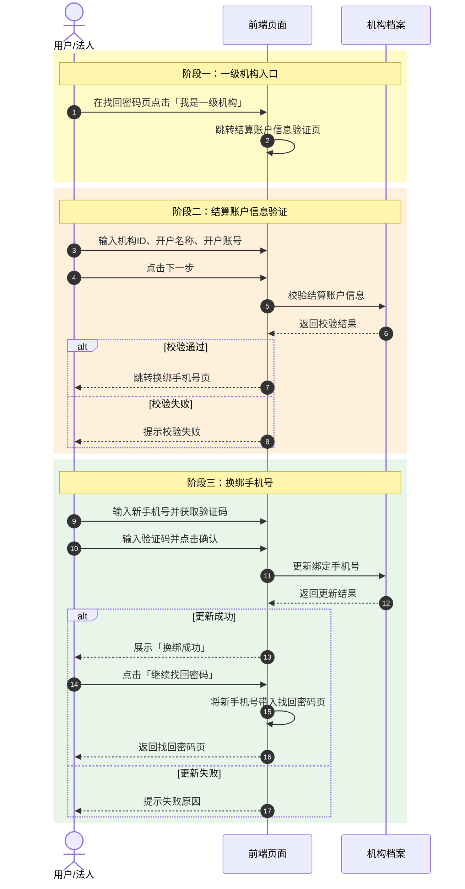

# 一级机构手机号找回方案时序图

> 基于推荐方案二：点击「我是一级机构」→ 结算账户信息验证 → 换绑手机号 → 换绑成功 → 返回找回密码页。

## 说明
- 流程与 `v2.html` 页面结构保持一致：找回密码页 → 结算账户信息验证页 → 换绑手机号页 → 换绑成功页 → 返回找回密码页。
- 校验或更新失败时停留在当前页，用户可修正后重新提交。
- 换绑成功后点击「继续找回密码」，前端自动将新手机号回填至找回密码页的手机号输入框，形成完整闭环。
